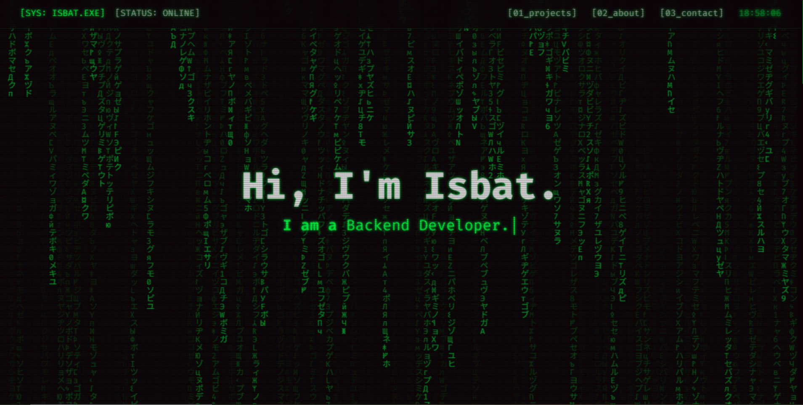

# Matrix themed Backend Engineer Portfolio

This is a responsive, dark-themed portfolio website, built with Next.js and Tailwind CSS. The design is heavily inspired by classic hacker terminals and sci-fi aesthetics like _The Matrix_, featuring CRT effects, a "digital rain" background, and a cinematic boot-up loader sequence.



---

## Features

- **Thematic Design:** A cohesive "hacker terminal" aesthetic with CRT screen effects, scan lines, and a green-on-black color scheme.
- **Cinematic Loader:** A multi-stage boot-up sequence that simulates a system hack, running only on the user's first visit.
- **Interactive Background:** A subtle grid pattern that lights up with a pulsing "spotlight" effect around the user's cursor.
- **"Decrypting" Project Cards:** Project cards that start as "encrypted" noise and are revealed with a scanning animation as they scroll into view.
- **Fully Responsive:** Designed to look great on desktop, tablet, and mobile devices.
- **Easy to Customize:** All personal data (name, projects, links, etc.) is managed in a single `src/data/config.js` file for easy updates.

---

## Tech Stack

- **Framework:** [Next.js](https://nextjs.org/) (App Router)
- **Styling:** [Tailwind CSS](https://tailwindcss.com/)
- **Animations:** [Framer Motion](https://www.framer.com/motion/) & [React Type Animation](https://www.npmjs.com/package/react-type-animation)

---

## Running Locally

To get a local copy up and running, follow these simple steps.

### Prerequisites

You need to have [Node.js](https://nodejs.org/) (version 18.x or later) and npm installed on your machine.

### Installation

1.  **Fork the repository** to your own GitHub account.
2.  **Clone your fork** to your local machine:
    ```sh
    git clone https://github.com/IsbatBInHossain/isbat-portfolio.git
    ```
3.  **Navigate into the project directory:**
    ```sh
    cd isbat-portfolio
    ```
4.  **Install NPM packages:**
    ```sh
    npm install
    ```
5.  **Run the development server:**
    ```sh
    npm run dev
    ```
    Open [http://localhost:3000](http://localhost:3000) with your browser to see the result.

---

## How to Customize

1.  Open `src/data/config.js`.
2.  Modify the JavaScript object with your personal information, project details, social links, and ASCII art.
3.  Replace the favicon at `public/icon.svg` with your own.

---

## License

This project is licensed under the **GNU General Public License v3.0**. See the `LICENSE` file for details.

In short, you are free to use, modify, and share this project for any purpose, but you are encouraged to share your changes under the same license.

## Contributing

If you find any bugs or have suggestions, feel free to [open an issue](../../issues).

### You can:

- 💡 Suggest a feature or improvement
- 🐞 Report bugs (include screenshots if possible)

Feel free to leave a star if you like the site.
